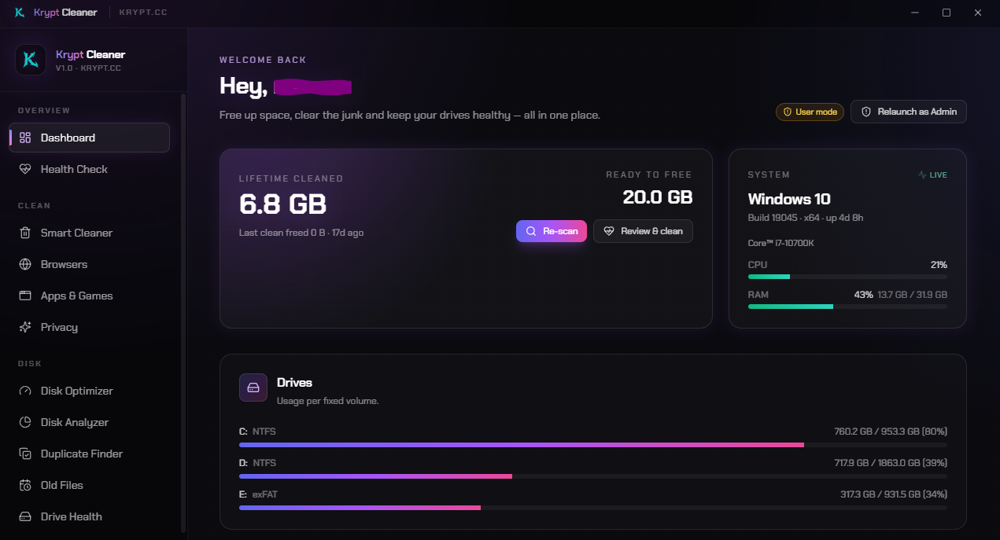

<div align="center">


# Krypt Cleaner

**A free, open-source PC cleaner & disk optimizer for Windows.**

Reclaim real disk space — temp, caches, browser and privacy junk — and every risky action is badged, backed up and reversible.

[](LICENSE)
&nbsp;[](#download)
&nbsp;[](#download)
&nbsp;[](https://discord.gg/muzFKR657F)
&nbsp;[](https://krypt.cc)

</div>

---

Krypt Cleaner finds the junk that actually adds up — temp files, browser and app caches, shader data, privacy traces and disk bloat — and clears it through a modern UI instead of a "cleaner" that quietly bundles adware. It tells you exactly how much you can reclaim, labels every action by risk, snapshots privacy data before it touches it, and never auto-deletes your files.

<div align="center">
  
</div>

## Download

<a href="../../releases/latest"></a>

Grab the latest `.exe` from the [**Releases**](../../releases/latest) page, run it, and you're set. Works on Windows 10 and Windows 11 (x64).

> The build isn't code-signed yet, so the first launch may show a SmartScreen prompt — click **More info → Run anyway**. The full source is right here if you'd rather build it yourself.

## What it does

- **One-click Health Check** — scans every safe target, shows the reclaimable total on a live dial, and clears it. Nothing risky runs here.
- **Smart Cleaner** — system junk: `%TEMP%`, Windows temp, thumbnail/icon/font caches, shader caches, crash dumps, WER reports, Delivery Optimization, update cache and the Recycle Bin — each tiered safe, caution or risky.
- **Deep browser cleaning** — per-profile cache, cookies, history, sessions and saved passwords for Chrome, Edge, Brave, Vivaldi, Opera, Opera GX and Firefox. Cache is preselected; cookies and history are opt-in; passwords are gated as risky.
- **App & game caches** — Discord, Spotify, Slack, Teams, Steam, Epic, VS Code and Adobe, plus NVIDIA / AMD / Intel shader caches.
- **Privacy traces** — recent docs, Run history, Explorer search, typed URLs and program-launch records — snapshotted to a backup before they're cleared so you can roll them back.
- **Disk Optimizer** — detects each drive's media type and does the right thing: TRIM for SSDs (never a mechanical defrag), defragmentation only for HDDs, plus DISM WinSxS analyze and clean.
- **Disk Analyzer** — a drill-down treemap of what's eating your disk, with the biggest files called out for one-click reveal or delete.
- **Duplicate Finder** — a fast size → signature → full-hash pass so only true byte-for-byte copies are reported. Krypt never auto-deletes; you pick the copy to keep.
- **Drive Health** — SMART-style health, SSD wear, temperature, power-on hours and error counters per physical disk. Read-only.

## Safe by design

- Every action carries an honest **risk label** — **safe** (regenerates on its own), **caution** (logs you out or loses state), **risky** (permanent data loss or system change, confirmed by dialog and never on by default).
- **Privacy data is snapshotted** to a backup before it's cleared, so it can be rolled back.
- **No silent failures** — every action ends in a toast and is written to the Action Log.
- Locked browser/app files are detected and flagged, so you're told to close the app rather than silently freeing 0 bytes.
- Recursive walks **skip symlinks and junctions**, so OneDrive placeholders and other reparse points are never followed or double-counted.
- No account, no telemetry, no bundled adware, no background service.

## Build from source

```powershell
npm install
npm run dev      # run in development
npm run dist     # build the NSIS installer into /release
```

Requires Node 18.18+ (20 LTS recommended) on Windows 10/11. Some actions (Windows temp, update caches, disk optimization, DISM) need Administrator — Krypt offers a one-click UAC relaunch, or run `run-as-admin.bat` from an elevated terminal in dev. App data lives in `%APPDATA%\Krypt Cleaner\` (settings and privacy backups) — never your Documents or Desktop.

## Links

- **Website** — [krypt.cc](https://krypt.cc) · more free tools at [krypt.cc/tools](https://krypt.cc/tools)
- **Support and community** — [Discord](https://discord.gg/muzFKR657F)

## License

Released under the [MIT License](LICENSE) — free to use, fork and share. Please don't rebrand and resell it.

<div align="center"><sub>Built by the Krypt team · <a href="https://krypt.cc">krypt.cc</a></sub></div>
